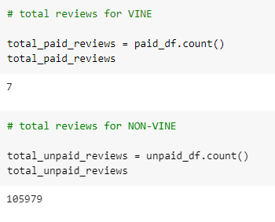
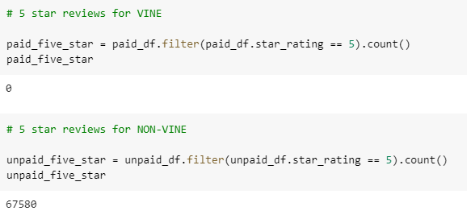
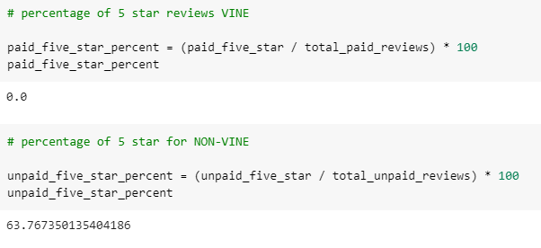
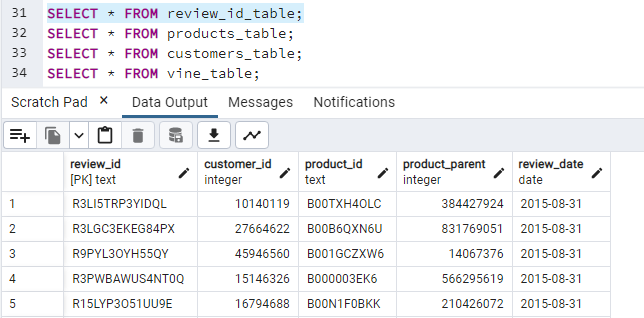
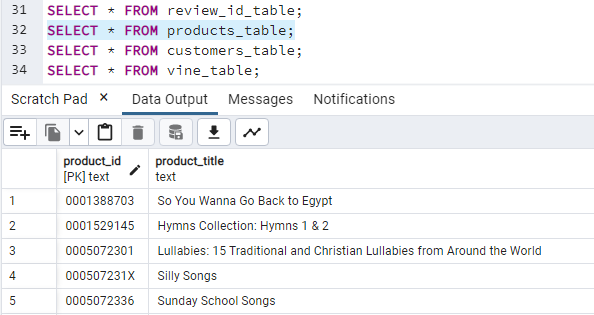
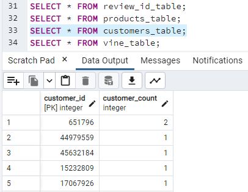
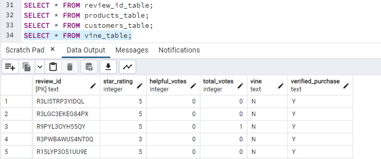

# Amazon Vine Analysis

## Overview of the Analysis

We were tasked with analyzing Amazon reviews written by members of the paid Amazon Vine program. We wanted to see the differences in rating and responses based on if customers were paid Vine members or not. I picked the Music dataset to analyze. 

Unfortunately within the dataset there didn't seem to be many Vine member, only 7.. which left me with limited information on the paid Vine customer side of my analysis.

## Results

* ### Total Number of Reviews
    * Vine Customers
        * For the Music dataset I chose, unfortunately there were only 7 total reviews for Vine subscribers.
    * Unpaid Customers
        * There was a total of 105,979 reviews for non-subscribers.

* ### 5 Star Reviews
    * Vine Customers
        * Given that there were only 7 total reviews for Vine subscribers, the dataset was small, and there were ZERO 5 star reviews out of the 7 total.
    * Unpaid Customers
        * There was a total of 67,580 5 star reviews for non-subscribers out of the total 105,979.

* ### Percentage of 5 Star Reviews
    * Vine Customers
        * Naturally, since there were zero out of 7 total Vine reviews, the percentage was 0% 5 star reviews. 
    * Unpaid Customers
        * There was a total of 67,580 5 star reviews for non-subscribers out of the total 105,979 which came out to a percentage of 63.77% 5 star reviews. 

## Summary

Based on the dataset I chose, there seems to be a lack of data on actual Vine subscribers or members. Given the lack of data, I would say it is inconclusive to whether Vine members give better or worse reviews than non-members. 

I included the pgAdmin output tables via AWS in the pictures below to confirm the export of the tables to our linked PostgreSQL.

## Additional Analysis Suggestion

We are going to have to get more data from Vine members to really be able to see the difference in ratings between members and non-members. 
* Based on the dataset i chose, music, it seems that most of Amazon's music customers are not Vine members. In other datasets it may be different. 
* I would recommend to Amazon to see if it would make sense to market towards music customers to see if they would want to be Vine members. 
    * What incentives can Vine offer to music customers in order to get them to become members? 
    * What are the current incentives to become a Vine member for music customers? 

### Review ID Table in pgAdmin

### Products Table

### Customers Table

### Vine Table
